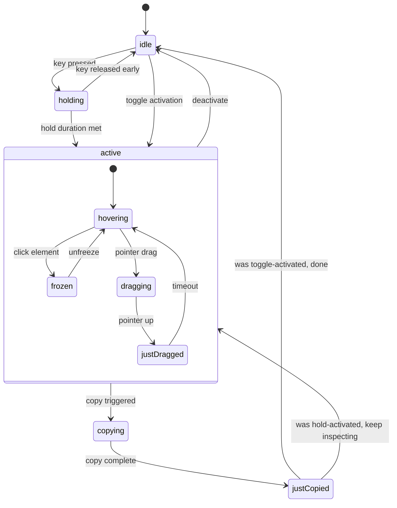

# Architecture Documentation

This document covers how react-grab's internals work. It's intended to aid in understanding the code, in understanding the tricks react-grab uses to freeze and inspect a live React application, and hopefully to enable people to modify the code. Many of the techniques described here are inherently fragile because they involve patching React's internal dispatcher, monkey-patching browser prototypes, and intercepting animation systems that were never designed to be paused from the outside. The current approach is not necessarily the best or only way to do these things, and some of these details will need to change as React's internals evolve.

### Design principles

- **Pause all rendering and animation while the overlay is active**
  When grab mode activates, the page needs to look completely frozen so the user can inspect it without things shifting around. This is harder than it sounds because there are many independent systems running concurrently on a typical page: React state updates trigger re-renders, CSS animations and transitions are playing, SVG SMIL animations are running, Web Animations API (WAAPI) instances are in flight, GSAP timelines may be active, and CSS pseudo-states like `:hover` change the moment the pointer moves toward the overlay. Each of these requires a different freezing strategy, and they must all be coordinated so that unfreezing replays or finishes everything cleanly without visual jumps.
- **Avoid interfering with the host application**
  The overlay UI lives in a Shadow DOM to avoid inheriting the page's styles or interfering with its event handling. The host element is mounted with `pointer-events: none` so it doesn't intercept clicks meant for the underlying page. When react-grab claims a keyboard shortcut, it patches the `KeyboardEvent.prototype.key` getter so that claimed events report an empty string to the app's own handlers, rather than trying to call `stopPropagation`, which would be unreliable with React's synthetic event delegation.
- **Keep orchestration in one place, factor out utilities**
  The [core/index.tsx](../src/core/index.tsx) file is large on purpose. SolidJS components are setup functions that run once (not render functions that re-execute on every update), so `init()` is effectively a single procedural function that wires up the store, plugin registry, event listeners, effects, and renderer. The reactive graph handles all subsequent updates from there. Smaller concerns like element detection, animation freezing, clipboard writing, and bounds calculation are factored out into focused utility files under `utils/`, but the orchestration logic stays together in one place so you can follow the full activation-to-copy flow without jumping between files.
- **Implement all user-facing actions as plugins**
  Every user-facing action — copy snippet, copy HTML, copy styles, add comment, open in editor — is implemented as a plugin that registers context-menu entries and hooks. The core doesn't hardcode any clipboard behavior. When the user triggers a copy, the content passes through a pipeline of plugin transforms (`onBeforeCopy`, `transformSnippet`, `transformCopyContent`) before it reaches the clipboard. This means external consumers can modify or replace any step of the copy process without forking the library.
- **Lazy-load the rendering layer separately from the interaction logic**
  The SolidJS UI components (canvas overlay, toolbar, selection labels, context menus) are loaded via a dynamic `import()` so that the interaction-detection logic in `core/index.tsx` can initialize immediately without waiting for the heavier rendering code to parse and execute. If the dynamic import fails for any reason, react-grab logs the error but continues to function without the visual overlay.

## Overview

The runtime has two main concerns: initialization and the interaction lifecycle. Both reside primarily in [core/index.tsx](../src/core/index.tsx).

### Initialization

When the package is imported in a browser environment, [index.ts](../src/index.ts) checks that `window` exists and `__REACT_GRAB_DISABLED__` is not set, then calls `init()`. The returned API object is assigned to `window.__REACT_GRAB__`, any plugins that were registered via `registerPlugin()` before initialization completed are flushed from a pending queue, and a `react-grab:init` custom event is dispatched so other code on the page can react to the tool being ready. If `init()` is called in an SSR environment or when the tool is disabled, it returns a no-op API object with the same shape so that consumers don't need to guard every call.

Inside `init()`, the first thing that happens is merging any options provided programmatically with options parsed from the `data-options` JSON attribute on the script tag (via `getScriptOptions()`). Then `createPluginRegistry` and `createGrabStore` are called to set up the reactive state. A single `AbortController` manages all event listeners on `window` and `document`, so that teardown is a single `abort()` call. The five built-in plugins (copy, comment, open, copy-html, copy-styles) are registered through the same `register()` path that external plugins use. Finally, the renderer is loaded asynchronously via `import("../components/renderer.js")` and mounted into a Shadow DOM container created by [utils/mount-root.ts](../src/utils/mount-root.ts).

### The interaction lifecycle

The interaction state is modeled as a discriminated union called `GrabState` in [core/store.ts](../src/core/store.ts):

The user can activate react-grab either by holding a key for a configurable duration (the `holding` state) or by toggling it on and off. Once `active`, the tool enters one of several phases: `hovering` (tracking the pointer and highlighting elements under it), `frozen` (the user clicked an element to lock the selection), `dragging` (the user is drawing a rectangle to select multiple elements), or `justDragged` (a brief transitional phase after a drag ends). The `copying` state represents the brief moment while clipboard content is being generated, and `justCopied` shows the success feedback before the tool either returns to `active` or deactivates.

The `wasActive` flag threaded through the `copying` and `justCopied` states controls this branching: when the user copies while in hold-to-activate mode, the tool returns to `active` after showing the copy feedback so they can continue inspecting while the key is held, but when the user copies while in toggle mode the tool deactivates because the copy action consumes the toggle.

During the `active` state, pointer and keyboard event handlers update the store with the current pointer position, the detected element under the pointer (throttled and cached), and any drag rectangle coordinates. SolidJS memos derived from these signals compute the overlay bounds, selection label content, component names, and other UI state. The canvas overlay and DOM-based UI components subscribe to these memos and update reactively.

## Notes about freezing

Freezing is the most technically interesting part of the codebase. There are three independent systems that need to be paused simultaneously, each requiring a different technique.

### React update freezing

There is no public React API to pause rendering. The module [utils/freeze-updates.ts](../src/utils/freeze-updates.ts) works around this by patching React's internal dispatcher — the object React reads from on every hook call to determine which implementation of `useState`, `useReducer`, etc. to use.

The dispatcher lives at `ReactCurrentDispatcher.H` (React 19+) or `ReactCurrentDispatcher.current` (earlier versions) inside the renderer object that [bippy](https://bippy.dev) exposes. `installDispatcherPatching` replaces this property with a getter that calls `patchDispatcher` on every access. `patchDispatcher` wraps the four stateful hooks so that when `isUpdatesPaused` is true, dispatches are redirected:

- `useState` and `useReducer` dispatches are pushed onto the `pendingStateUpdates` array.
- `useTransition` callbacks are pushed onto the `pendingTransitionCallbacks` array.
- `useSyncExternalStore` subscription callbacks are collected in the `pendingStoreCallbacks` set.

In addition to intercepting dispatches, `pauseHookQueue` redefines each fiber's `queue.pending` property as a getter/setter pair. React's internal update queue is a circular linked list where `queue.pending` points to the last node, and `pending.next` points to the first. The getter returns `null` while paused (so React thinks there are no pending updates), while the setter buffers any new updates that React tries to enqueue into `bufferedPending`. The `getSnapshot` function for external stores is similarly replaced with a frozen version that returns the value captured at pause time.

On unfreeze, the buffered state is replayed in a specific order: store callbacks first, then transitions, then state updates. This ordering matters because store subscriptions may trigger state updates of their own, and transitions should batch correctly. After replay, `scheduleReactUpdate` calls `renderer.scheduleUpdate` on each fiber root to trigger a re-render. Every replay path is wrapped in try/catch because this entire approach is coupled to React's internal data structures, which may change between versions.

### Animation freezing

The module [utils/freeze-animations.ts](../src/utils/freeze-animations.ts) handles four different animation systems:

**CSS animations and transitions** are paused by injecting a stylesheet that sets `animation-play-state: paused !important` and `transition: none !important` on all affected elements. For element-level freezing, the stylesheet targets elements with a `data-react-grab-frozen` attribute. For global freezing, it uses `*, *::before, *::after`.

**SVG SMIL animations** are paused by calling `pauseAnimations()` on each `SVGSVGElement`. An important detail here is the depth-counting system: since an SVG element can be frozen both by the element-level freeze and the global freeze simultaneously, each SVG tracks a reference count in `svgFreezeDepthMap`. The SVG is only unpaused when all freeze layers have been removed, preventing a partial unfreeze from resuming animations prematurely.

**Web Animations API (WAAPI) instances** are collected from `element.getAnimations({ subtree: true })` and paused individually.

**GSAP** is handled by a separate module [utils/freeze-gsap.ts](../src/utils/freeze-gsap.ts) that pauses the global GSAP timeline if GSAP is present on the page.

On unfreeze, animations are `finish()`ed rather than resumed. This is deliberate: resuming a paused animation from the mid-point would cause visual jumps — for example, a dropdown that was mid-way through its entry animation would suddenly snap through the remaining frames. Finishing advances the animation to its end state, and the interim `transition: none` rule prevents any visual flash during cleanup. Shadow-root animations are excluded from the global freeze because the injected CSS only affects main-document elements; calling `finish()` on animations that were never actually paused would break react-grab's own toolbar and label animations.

### Pseudo-state freezing

The module [utils/freeze-pseudo-states.ts](../src/utils/freeze-pseudo-states.ts) handles CSS pseudo-classes like `:hover` and `:focus`. When the user activates grab mode and hovers over an element, that element may have styles that only apply in the `:hover` state (e.g. a button changing color). As soon as the pointer moves to the react-grab overlay, the browser removes the `:hover` state from the original element and the visual appearance changes.

To prevent this, `freezePseudoStates` captures the current computed styles that are associated with the `:hover` and `:focus` pseudo-classes and applies them as inline styles on the element. This way, even after the pointer moves away, the element continues to look exactly as it did when the user first pointed at it. On unfreeze, the injected inline styles are removed.

## Notes about the overlay

### Shadow DOM mount

The overlay is mounted via [utils/mount-root.ts](../src/utils/mount-root.ts). A host `
` is created that covers the entire viewport with `position: fixed; inset: 0` at a high z-index. It has `pointer-events: none` so that it doesn't intercept clicks meant for the underlying page; individual child UI elements (toolbar buttons, label text areas, etc.) opt in to pointer events individually via CSS.

The host attaches a shadow root in `open` mode, injects the compiled CSS as a `<style>` element, and appends a container `
` that serves as the mount point for SolidJS's `render()`. There is one subtle detail worth noting: the host is re-appended to the document body via `setTimeout` after a short delay. This handles two edge cases that come up in practice. First, React and Next.js hydration can blow away the host element if it was appended before hydration completed. Second, if another tool (like react-scan) has appended its own overlay at the same z-index, the last child in the DOM wins the stacking tiebreaker, so re-appending ensures react-grab stays on top.

### Canvas rendering

The visual highlight overlays are rendered via [components/overlay-canvas.tsx](../src/components/overlay-canvas.tsx) using a single `<canvas>` element with multiple `OffscreenCanvas` layers composited together. Each visual type — selection highlight, drag rectangle, grabbed-element flash, and inspect overlay — has its own offscreen layer with its own animated bounds.

The bounds for each layer are lerped toward their target positions on every animation frame using `requestAnimationFrame`, with different lerp factors for different interaction types. Selection highlights use a slower factor so the overlay doesn't jitter as the user moves between elements, while drag rectangles track the pointer more aggressively. Each frame, the main canvas clears itself and composites all visible layers. When the animation has converged (the current bounds are within a small threshold of the target bounds and the opacity has settled), the animation loop stops until the next reactive update triggers it again.

When the browser supports it, the canvas uses the `display-p3` color space for wider-gamut overlay colors. The device pixel ratio is also tracked and applied to ensure crisp rendering on high-DPI displays.

### Keyboard event claiming

When react-grab uses a keyboard shortcut (like Alt to activate grab mode), the app's own keyboard handlers should not also fire in response to that key. The module [core/keyboard-handlers.ts](../src/core/keyboard-handlers.ts) handles this by patching the `KeyboardEvent.prototype.key` getter.

The `setupKeyboardEventClaimer` function saves the original property descriptor for `key`, then installs a new getter. The new getter checks whether the event object is in a `WeakSet` of "claimed" events. If it is, the getter returns the empty string `""` instead of the actual key. This means any other handlers on the page that check `event.key` will see an empty string and (in most cases) ignore the event. This approach is more reliable than calling `stopPropagation()` because React's synthetic event system uses event delegation at the root, so by the time react-grab's handler runs, React's delegated handler may have already captured the event. The original getter is restored when react-grab is disposed.

## Notes about source resolution

The source resolution pipeline turns a DOM element the user is pointing at into a file path, line number, and component name. The pipeline has several layers, each handling a different part of the problem.

### From DOM element to React fiber

The entry point is `getStack()` in [core/context.ts](../src/core/context.ts), which takes a DOM element and returns an array of `StackFrame` objects. Results are cached per element in a `WeakMap` so that repeated lookups for the same element (which happen often as the user moves through the UI) don't redo the work.

The first step is finding the nearest ancestor element that has an associated React fiber, using bippy's `getFiberFromHostInstance`. This is necessary because not every DOM element maps to a fiber — text nodes, elements created outside of React, and elements inside Shadow DOMs (like react-grab's own overlay) won't have one. `findNearestFiberElement` walks up the DOM tree via `parentElement` until it finds an element with a fiber.

### From fiber to owner stack

Once we have a fiber, [bippy's](https://bippy.dev) `getOwnerStack()` constructs the component hierarchy above it. This works differently depending on the React version.

In React 19+, fibers have a `_debugStack` property that contains an `Error` object whose `.stack` string encodes the owner chain. React wraps the real component frames between two sentinels: `react-stack-top-frame` at the top and `react-stack-bottom-frame` at the bottom. bippy's `formatOwnerStack` strips these sentinels and the initial JSX frame, leaving just the component frames in between.

In older React versions (17–18), `_debugStack` doesn't exist, so bippy constructs a "fallback" owner stack by walking `fiber.return` up to the root. For each composite fiber it encounters, `describeNativeComponentFrame` actually _invokes the component function_ (or, for class components, the constructor via `Reflect.construct`) to generate a stack trace. It then compares this "sample" stack against a "control" stack produced by throwing from the same call site without the component, and extracts the single frame that differs — which is the frame belonging to the component itself. This is the same technique React DevTools uses internally to generate component stacks. The temporary invocation is guarded carefully: the dispatcher is set to `null` to prevent hooks from running, and `console.error` and `console.warn` are temporarily silenced to suppress React's warnings about calling components outside of a render context.

The result in both cases is a flat array of `StackFrame` objects, each with a `functionName` (the component name), a `fileName` (which at this point may be a bundled URL like `http://localhost:3000/_next/static/chunks/app.js`, a `file:///` URL, or a virtual `rsc://` URL), and `lineNumber`/`columnNumber` values that still reference positions in the bundled output.

### Source map symbolication

The stack frames at this point reference bundled file locations, not original source files. bippy's `symbolicateStack` resolves these by fetching each bundle URL, scanning its last lines for a `//# sourceMappingURL=` comment, fetching and decoding the referenced source map with `@jridgewell/sourcemap-codec`, and looking up the original position in the decoded mappings. For index source maps (which contain multiple `sections`), it finds the correct section based on the line/column offset before performing the lookup.

Source maps are cached using `WeakRef` when the runtime supports it, so they can be garbage collected under memory pressure while still avoiding redundant fetches during normal use. Concurrent requests for the same source map URL are deduplicated via a pending-request map to prevent duplicate fetches when multiple stack frames reference the same bundle.

### Server component enrichment

React Server Components present a special challenge because their stack frames use virtual URLs like `rsc://React/Server/webpack-internal:///...` that don't correspond to real files on disk. react-grab handles this in two passes within [core/context.ts](../src/core/context.ts).

The first pass, `enrichServerFrameLocations`, addresses the case where a server component appears in the fallback owner stack with a function name but no file name. It traverses the entire fiber tree looking for fibers that have `_debugStack` entries containing `rsc://` URLs, builds a map from function name to the corresponding `rsc://` frame, and then fills in the missing file names by matching function names. This gives server frames their virtual file URLs so the next pass can resolve them.

The second pass, `symbolicateServerFrames`, takes the enriched frames and POSTs them as a batch to the Next.js dev server's `/__nextjs_original-stack-frames` endpoint. This endpoint resolves the virtual `rsc://` URLs back to real source file paths via the server's own source maps. The function first calls `devirtualizeServerUrl` to strip the `rsc://React/Server/` prefix and any trailing query parameters, producing the `webpack-internal:///` path that Next.js's symbolication expects. The request includes a timeout via `AbortController` to avoid blocking indefinitely if the dev server is slow or unresponsive. `getNextBasePath()` is used to construct the endpoint URL, which is important for Next.js apps deployed with a `basePath` prefix.

### File name normalization

Throughout this pipeline, file names arrive in many different formats: HTTP URLs (`http://localhost:3000/src/App.tsx`), `file:///` URLs, `webpack-internal:///` paths, `rsc://React/Server/...` virtual paths, and paths with HMR query parameters (`?t=1711234567`). bippy's `normalizeFileName` handles all of these by stripping HTTP origins (extracting just the pathname), removing internal scheme prefixes in a loop (handling nested prefixes like `webpack-internal:///file:///...`), resolving `about://React/` URLs, and removing query parameters that match bundler patterns. It also strips a single-segment base path prefix for apps served under a subpath, but only when the remainder looks like a real source file with multiple path segments.

The companion function `isSourceFile` filters out anonymous file patterns, non-source extensions, and bundled file patterns (like chunk hashes) so that the UI only shows frames from user-authored code.

### Display name filtering

Even after resolving source locations, the component hierarchy often contains framework-internal names that aren't useful to show the user. [core/context.ts](../src/core/context.ts) maintains three filter lists for this purpose.

`NEXT_INTERNAL_COMPONENT_NAMES` is a set of about twenty Next.js App Router wrapper names like `InnerLayoutRouter`, `RedirectErrorBoundary`, and `AppRouter`. Without this filter, inspecting almost any element in a Next.js app would show these framework wrappers instead of the user's own component.

`REACT_INTERNAL_COMPONENT_NAMES` covers React's own built-in components like `Suspense`, `Fragment`, `StrictMode`, and `Profiler`.

`NON_COMPONENT_PREFIXES` catches library-internal naming conventions: names starting with `_` or `$` (common in compiled output), and prefixed names like `motion.`, `styled.`, `chakra.`, `ark.`, `Primitive.`, and `Slot.` from popular component libraries.

`getComponentDisplayName` walks up the fiber tree from the target element and returns the first composite fiber whose display name passes all of these filters. The result is typically the user's own component — the one they'd actually want to find in their editor.

### Opening in editor

The final step of the pipeline is [utils/open-file.ts](../src/utils/open-file.ts), which takes a resolved file path and optional line number and tries to open it in the user's code editor. It first attempts the dev server's built-in open-in-editor endpoint: `/__open-in-editor` for Vite or `/__nextjs_launch-editor` for Next.js. Both of these dev servers include middleware that launches the user's configured `$EDITOR` (or `$VISUAL`) with the file path and line number, so the file opens directly in their editor without any browser interaction.

If the dev server request fails — for example, because the app uses a framework that doesn't support this middleware, or because the dev server isn't running — the function falls back to opening a URL through `react-grab.com/open-file`, which redirects to a `vscode://file/...` protocol URL that VS Code handles natively.

## Notes about plugins

The plugin system is implemented in [core/plugin-registry.ts](../src/core/plugin-registry.ts). Each plugin is an object with a `name`, optional static properties (`theme`, `actions`, `hooks`, `options`), and an optional `setup` function that receives the `ReactGrabAPI` and the registry's hook dispatchers and returns a `PluginConfig`.

When a plugin is registered, its static properties are merged with any values returned by `setup()`. Theme values are deep-merged (so a plugin can override just the hue without replacing the entire theme object). Options are shallow-merged. Context-menu actions are concatenated. If a plugin with the same name was already registered, the old one is unregistered first (its `cleanup` function is called if present).

After every registration or unregistration, `recomputeStore` iterates over all plugins in insertion order and rebuilds the merged theme, options, and action list from scratch. This is stored in a SolidJS reactive store, so the UI automatically updates when a plugin is added or removed.

### Hook dispatch patterns

The registry provides several ways to call hooks, each suited to a different use case:

`callHook` calls every registered plugin's implementation of a given hook, ignoring return values. This is used for notification-style hooks like `onActivate`, `onDeactivate`, `onElementHover`, and `onCopySuccess`.

`callHookWithHandled` calls every plugin's hook but tracks whether any of them returned `true`. This is used for `onOpenFile`, where a plugin may want to intercept the default behavior. `onElementSelect` has its own dedicated implementation rather than using `callHookWithHandled`, because it needs to support both synchronous `true` returns and async `Promise<boolean>` returns for interception.

`callHookReduce` threads a value through every plugin's transform function sequentially, each receiving the output of the previous one. This creates a pipeline where each plugin can modify the content in turn. It's used for `transformCopyContent`, `transformSnippet`, `transformHtmlContent`, and `transformAgentContext`. There is also a synchronous variant, `callHookReduceSync`, used for `transformOpenFileUrl`, `transformActionContext`, and other transforms that don't need to be async.

### Built-in plugins

The five built-in plugins are registered during `init()` through the same `register()` path that external plugins use, so there is nothing architecturally special about them:

- **copy** registers the default "Copy" context-menu action that calls the copy flow.
- **comment** registers the "Comment" action that enters prompt mode.
- **open** registers the "Open in editor" action that calls `openFile` with the resolved source location, running the URL through the `transformOpenFileUrl` hook pipeline first.
- **copy-html** registers "Copy HTML" which copies the element's `outerHTML` with stack context appended.
- **copy-styles** registers "Copy styles" which extracts the element's computed CSS (compared against a baseline from a hidden iframe) and copies it with stack context.

## Notes about MCP integration

The `@react-grab/mcp` package provides a plugin that bridges react-grab with AI coding assistants via the Model Context Protocol. The plugin hooks into `transformAgentContext` and `onCopySuccess` to POST element context to a local MCP server whenever the user copies or submits a prompt. The MCP server in turn exposes this context as MCP resources that coding assistants like Cursor and Claude Code can read. The plugin is registered like any other plugin and has no special privileges in the core.
